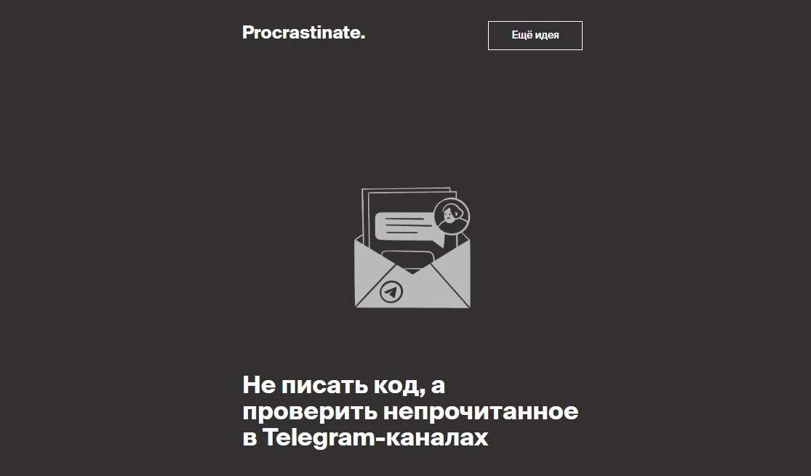
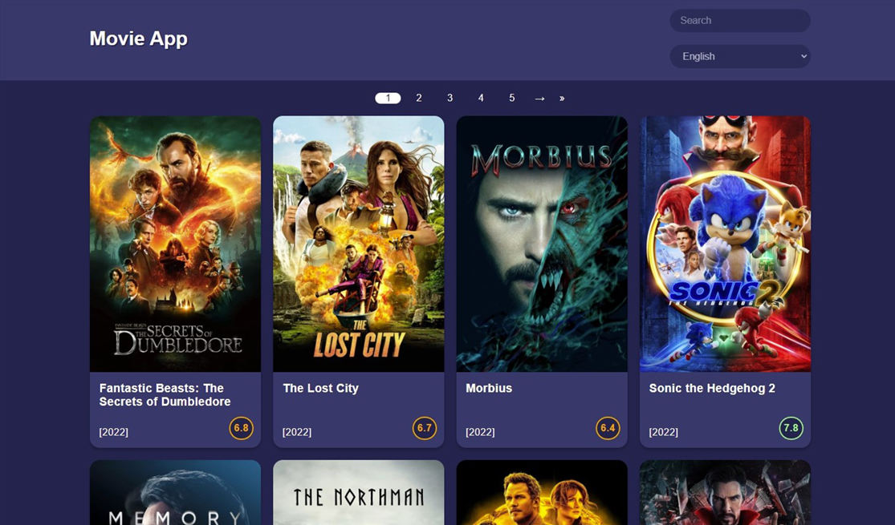
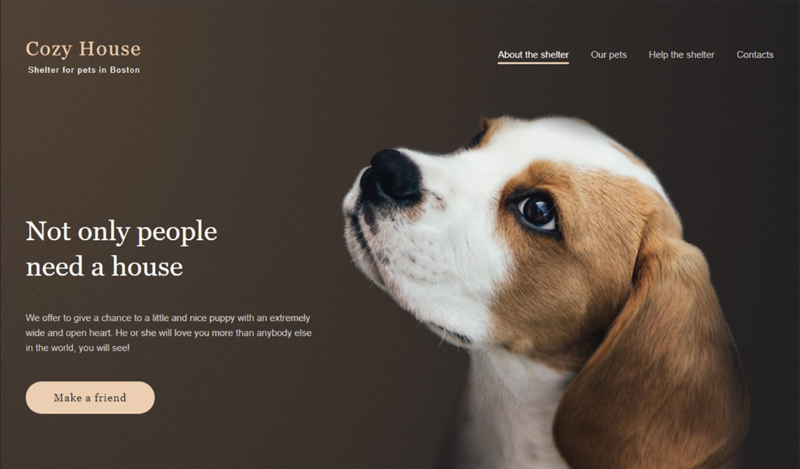
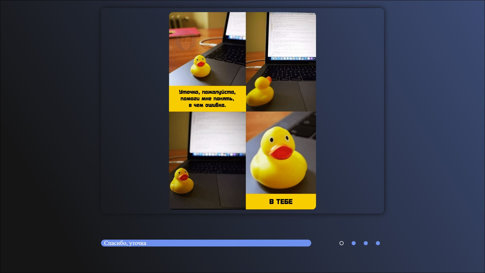
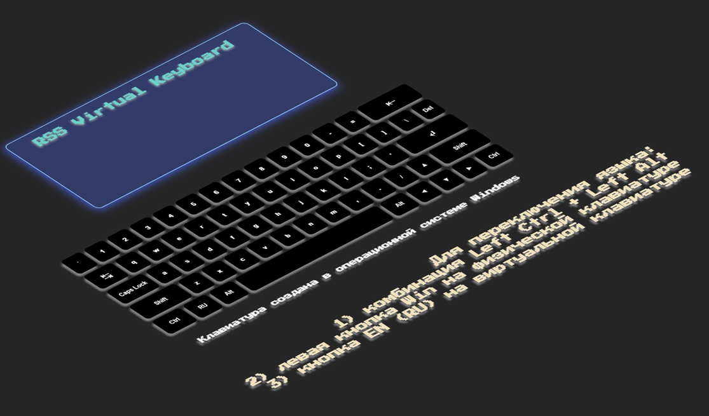
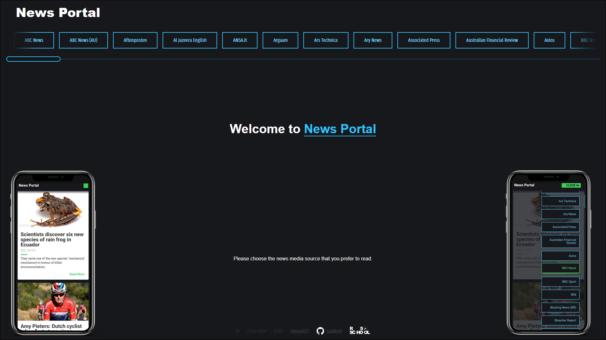
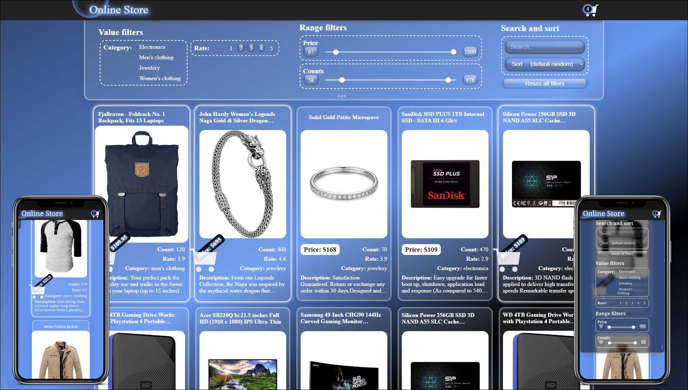

| <h1>Stanislau Yarotski</h1>   <h2>Contacts</h2><blockquote align="left"><ul><li>  <a href="mailto:stas_yar@tut.by"> stas_yar@tut.by</a></li><li>  <a href="https://discordapp.com/users/399246428871983114/"> truecki#6712</a></li><li>  <a href="https://www.linkedin.com/in/yarotski-stanislau/"> Stanislau Yarotski</a></li></ul></blockquote> | |
| ------ | ------ |

<h2>About myself</h2>

My name is Stanislau. I'm 31.

I am interested in Frontend Development because this occupation provides endless possibilities for professional growth, besides there is a huge amount of free high quality resources for self-education and a large community of developers.

I believe, that my ability to learn and to gain new skills will lead me through this path of becoming a proficient Frontend Developer.

Maybe I could be of some help to you.

<h2>What can I do already?</h2>

| <blockquote align="left"><ul><li>My general skills
   and also I have ... C,C++,C# basic skills ... QA basic skills ... and I know the working basics with               
</li> <li>My usual Frontend Stack          </li>  <li>My usual Backend Stack       </li></ul></blockquote>
You also can visit my CodeWars: 
 |  |
| ------ | ------ |

       
<h2>Education</h2>
<ul>
   <li>Polotsk State University, Faculty of Information Technologies - Software Engineer</li>
   <li>Courses:
      <ul>
         <li>Andersen. Сourse «Basics of Software Testing»</li>
         <li>html academy. Сourse «Introduction to HTML and CSS»</li>
         <li>Yandex Practicum. Сourse «Wed Developer»</li>
         <li>RS School. Course «JavaScript/Front-end. Stage 0»</li>
         <li>RS School. Course «JavaScript/Front-end. Stage 1»</li>
         <li>RS School. Course «JavaScript/Front-end. Stage 2»</li>
         <li>RS School. Course «React»</li>
         <li>RS School. Course «NodeJS»</li>
      </ul>
   </li>
</ul>

<h2>Languages</h2>
<ul>
   <li>Russian - Native</li>
   <li>English - A2</li>
</ul>

<h2 title="My projects">My projects</h2>

|                           <a href="https://badikgit.github.io/portfolio-test/source/project-procrastinate/" target="_blank">Procrastinate.</a>                       
Yandex Practicum project

    Stack:   
|  |
| ------ | ------ |

|  |                            <a href="https://rolling-scopes-school.github.io/badikgit-JSFEPRESCHOOL/portfolio/" target="_blank">Portfolio</a>                       
RSSchool JS/FE Stage 0 project

    Stack:   
 |
| ------ | ------ |

|
(requests without VPN may not work)
                          <a href="https://rolling-scopes-school.github.io/badikgit-JSFEPRESCHOOL/movie-app/" target="_blank">Movie app</a>                       
RSSchool JS/FE Stage 0 project

   Stack:   
||
| ------ | ------ |

|  |                          <a href="https://rolling-scopes-school.github.io/badikgit-JSFE2022Q1/shelter/pages/main/" target="_blank">Shelter</a>                      
RSSchool JS/FE Stage 1 project

    Stack:   
|
| ------ | ------ |

|                     <a href="https://badikgit.github.io/cssMemSlider/cssMemSlider/">CSS Mem Slider</a>                
RSSchool JS/FE Stage 1 project

    Stack:  
||
| ------ | ------ |

|  |                          <a href="https://badikgit.github.io/virtual-keyboard/" target="_blank">Virtual Keyboard</a>                    
RSSchool JS/FE Stage 1 project

    Stack:  
|
| ------ | ------ |

|                       <a href="https://badikgit-migration-newip-to-ts.netlify.app/">News Portal</a>                  
RSSchool JS/FE Stage 2 project

 Stack:       
||
| ------ | ------ |

|  |                       <a href="https://badikgit-online-store.netlify.app/" target="_blank">Online Store</a>                      
RSSchool JS/FE Stage 2 project

 Stack:        
|
| ------ | ------ |

