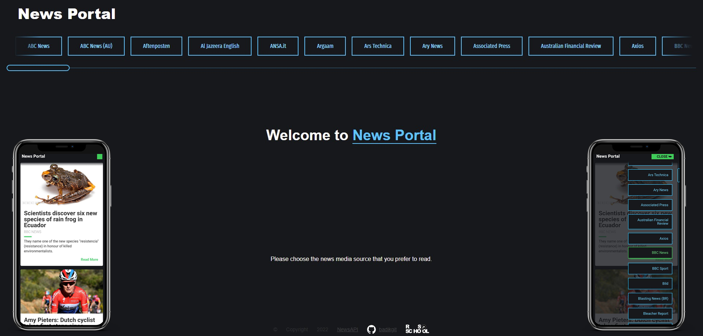
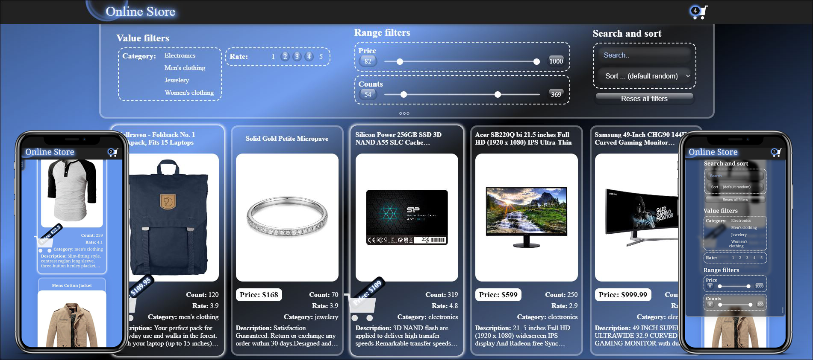

| <h1>Stanislau Yarotski</h1>   <h2>Contacts</h2><blockquote align="left"><ul><li>  <a href="mailto:stas_yar@tut.by"> stas_yar@tut.by</a></li><li>  <a href="https://discordapp.com/users/399246428871983114/"> truecki#6712</a></li><li>  <a href=""> Stanislau Yarotski</a></li></ul></blockquote> | |
| ------ | ------ |

<h2>About myself</h2>

My name is Stanislau. I'm 31. And I'm a giraffe... so... If you need something that is high up, I can help you get it :)

Okay, this is just a joke for the sake of being able to use this perfect image. It's my avatar. I did it myself. I like handling pictures and everything that is related to design. And I enjoy coding, too. So I got interested to Frontend Development.

I am interested in Frontend Development because this occupation provides endless possibilities for professional growth, besides there is a huge amount of free high quality resources for self-education and a large community of developers.

I believe, that my ability to learn and to gain new skills will lead me through this path of becoming a proficient Frontend Developer.

<h2>What can I do already?</h2>

| <blockquote align="left"><ul><li>I have skills in Figma, Adobe Photoshop, Adobe Illustrator</li><li>... have HTML5 & CSS & JavaScript skils</li><li>... React & TypeScript skils</li><li>... C,C++,C# basic skills</li><li>... QA basic skills</li><li>... and I know the working basics with Git, GitHub</li></ul></blockquote>
You also can visit my CodeWars: 
 |  |
| ------ | ------ |

       
<h2>Education</h2>
<ul>
   <li>Polotsk State University, Faculty of Information Technologies - Software Engineer</li>
   <li>Courses:
      <ul>
         <li>Andersen. Сourse «Basics of Software Testing»</li>
         <li>html academy. Сourse «Introduction to HTML and CSS»</li>
         <li>Yandex Practicum. Сourse «Wed Developer»</li>
         <li>RS School. Course «JavaScript/Front-end. Stage 0»</li>
         <li>RS School. Course «JavaScript/Front-end. Stage 1»</li>
         <li>RS School. Course «JavaScript/Front-end. Stage 2»</li>
         <li>RS School. Course «NodeJS» (failed to complete, but I tried)</li>
         <li>RS School. Course «React» (in progress)</li>
         <li>RS School. Course «Angular» (in progress)</li>
      </ul>
   </li>
</ul>

<h2>Languages</h2>
<ul>
   <li>Russian - Native</li>
   <li>English - A2</li>
</ul>

<h2 title="My projects">My projects</h2>

| <a href="https://badikgit.github.io/portfolio-test/source/project-procrastinate/" target="_blank">                      Procrastinate.                       </a>
Yandex Practicum project
 |  |
| ------ | ------ |

|  | <a href="https://badikgit.github.io/portfolio-test/source/project-procrastinate/" target="_blank">                       Portfolio                       </a>
RSSchool JS/FE Stage 0 project
 |
| ------ | ------ |

| <a href="https://rolling-scopes-school.github.io/badikgit-JSFEPRESCHOOL/movie-app/" target="_blank">                      Movie app                       </a>
RSSchool JS/FE Stage 0 project
 |  |
| ------ | ------ |

|  | <a href="https://rolling-scopes-school.github.io/badikgit-JSFE2022Q1/shelter/pages/main/" target="_blank">                    Shelter                      </a>
RSSchool JS/FE Stage 1 project
 |
| ------ | ------ |

| <a href="https://badikgit.github.io/cssMemSlider/cssMemSlider/">                     CSS Mem Slider                       </a>
RSSchool JS/FE Stage 1 project
 |  |
| ------ | ------ |

|  | <a href="https://badikgit.github.io/virtual-keyboard/" target="_blank">                    Virtual Keyboard                    </a>
RSSchool JS/FE Stage 1 project
 |
| ------ | ------ |

| <a href="https://badikgit-migration-newip-to-ts.netlify.app/">                    News Portal                      </a>
RSSchool JS/FE Stage 2 project
 |  |
| ------ | ------ |

|  | <a href="https://badikgit-online-store.netlify.app/" target="_blank">                    Online Store                      </a>
RSSchool JS/FE Stage 2 project
 |
| ------ | ------ |

